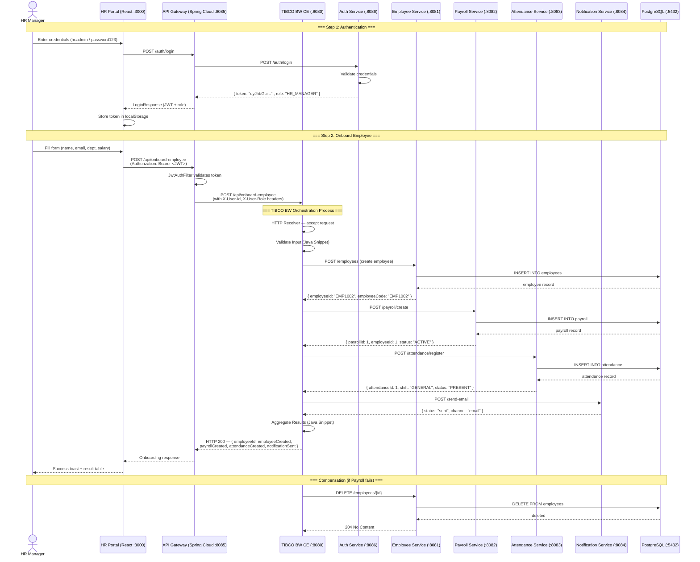

# Architecture Documentation

## Sequence Diagram — Employee Onboarding Flow



## Component Architecture

```
┌─────────────────────────────────────────────────────────────┐
│                    HR Manager (Browser)                      │
└──────────────────────┬──────────────────────────────────────┘
                       │
┌──────────────────────▼──────────────────────────────────────┐
│              React Portal (hr-portal :3000)                  │
│    Login · Dashboard · OnboardEmployee · EmployeeList        │
└──────────────────────┬──────────────────────────────────────┘
                       │ HTTP (JWT Bearer)
┌──────────────────────▼──────────────────────────────────────┐
│          API Gateway (gateway :8085)                         │
│  JwtAuthFilter · Route to all services · 401 on bad token    │
└──┬────────┬──────────┬──────────┬──────────┬───────────────┘
   │        │          │          │          │
   ▼        ▼          ▼          ▼          ▼
┌──────┐ ┌──────┐ ┌──────┐ ┌──────┐ ┌──────────┐
│ Auth  │ │ TIBCO│ │ Emp  │ │ Pay  │ │Notification│
│:8086 │ │ BW   │ │:8081 │ │:8082 │ │ :8084     │
│JWT   │ │ CE   │ │CRUD  │ │Mgmt  │ │ Email/SMS │
│Login │ │:8080 │ │Emp   │ │Payroll│ │ (mock)    │
└──────┘ └──────┘ └──┬───┘ └──┬───┘ └──────────┘
                      │        │
                      ▼        ▼
                    ┌──────────────┐
                    │  Attendance  │
                    │  :8083       │
                    │  Register    │
                    └──────────────┘
                           │
                           ▼
                    ┌──────────────┐
                    │  PostgreSQL  │
                    │  :5432       │
                    │hub-integration│
                    └──────────────┘
```

## Error Handling Strategy

| Step | Failure | Action | Status Code |
|------|---------|--------|-------------|
| 1. Create Employee | Service down | Return error to TIBCO | 503 |
| 2. Create Payroll | Employee ID invalid | Compensation: delete employee | 500 |
| 3. Register Attendance | Employee not found | Log warning, continue flow | 200 (warn) |
| 4. Send Notification | SMTP unavailable | Log warning, continue flow | 200 (warn) |
| Any | Unexpected exception | Global error handler | 500 |

## Service URLs (Local)

| Service | URL | Swagger |
|---------|-----|---------|
| API Gateway | http://localhost:8085 | http://localhost:8085/swagger-ui.html |
| Auth Service | http://localhost:8086 | http://localhost:8086/swagger-ui.html |
| Employee Service | http://localhost:8081 | http://localhost:8081/swagger-ui.html |
| Payroll Service | http://localhost:8082 | http://localhost:8082/swagger-ui.html |
| Attendance Service | http://localhost:8083 | http://localhost:8083/swagger-ui.html |
| Notification Service | http://localhost:8084 | http://localhost:8084/swagger-ui.html |
| TIBCO BW CE | http://localhost:8080 | — |
| HR Portal | http://localhost:3000 | — |
| PostgreSQL | localhost:5432 | — |
